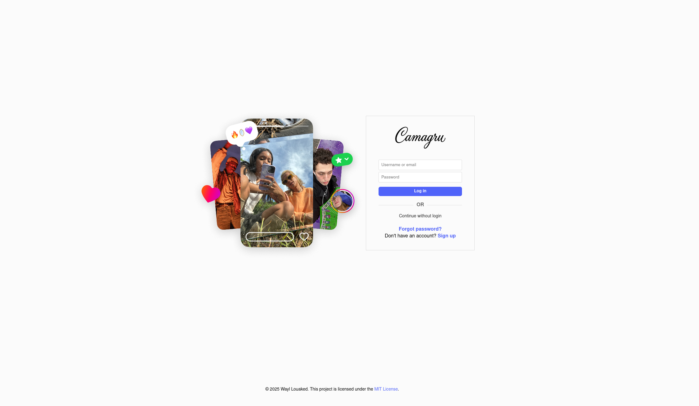

# Camagru

# Introduction

Instagram is a social media platform that allows users to share photos and videos with their followers.\
The goal of this project is to create a simplified clone of Instagram called Camagru. I had to develop a web application that allows users to take photos using their webcam, apply fun filters and stickers to them, and share their creations in a public gallery. The application also includes social features such as liking and commenting on photos.\
This project is built from scratch using vanilla PHP, HTML, CSS, and JavaScript, without any frameworks. All user data is stored in a database, and the application implements essential security features such as password hashing, SQL injection prevention, and XSS protection.\
Here are some key features I've implemented to make Camagru a functional and secure photo-sharing platform:

<p align="center">
  
</p>

## Clone the repository
```bash
git clone git@github.com:louakedwayl/Camagru.git
```

## 🛠️ Installation
```bash
make && make run
```

## Access Camagru
```bash
http://localhost:8080/
```

## 📝 License
© This project is licensed under the MIT License.

---

## 👤 Auteur

**Louaked Wayl**

- GitHub: [@louakedwayl](https://github.com/louakedwayl)
- LinkedIn: [@louakedwayl](https://www.linkedin.com/in/louakedwayl)
- Root-Me: [@louakedwayl](https://www.root-me.org/louakedwayl)
---
