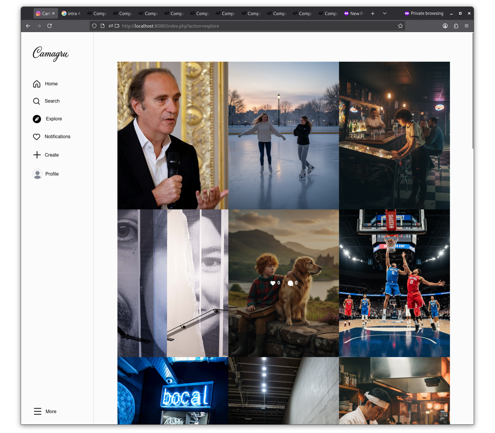

# Camagru

A full-stack Instagram clone built from scratch — no frameworks, no libraries, just raw PHP, JavaScript, HTML, and CSS.

The application replicates the core Instagram experience: webcam photo capture, sticker overlays composited server-side with GD, a public gallery with social interactions, and a real-time notification system. Everything runs in Docker with a MySQL backend.

Built with a strong focus on security: all inputs are validated and sanitized, passwords are hashed with bcrypt, queries use prepared statements, and every form is protected against CSRF.

<table>
  <tr>
    <td></td>
    <td></td>
  </tr>
  <tr>
    <td></td>
    <td></td>
  </tr>
</table>

## Stack

- **Backend** — PHP (vanilla, no framework)
- **Frontend** — HTML, CSS, JavaScript (vanilla)
- **Database** — MySQL
- **Infrastructure** — Docker / Docker Compose

## Features

- User registration and login with email verification
- Webcam capture and file upload
- Sticker/filter overlay on images (server-side compositing with GD)
- Public gallery with pagination
- Like and comment system
- Real-time notification bar (likes & comments)
- Email notifications on interactions
- User profile with avatar upload
- Real-time search
- Responsive design

## Security

- Password hashing (bcrypt)
- Prepared statements (SQL injection prevention)
- Output escaping (XSS protection)
- Server-side input validation
- CSRF token protection

## Getting Started

### Prerequisites

- Docker & Docker Compose
- A `.env` file (available on request — see below)

### Clone

```bash
git clone git@github.com:louakedwayl/Camagru.git
cd Camagru
```

### Run

```bash
make
```

Then open [http://localhost:8080](http://localhost:8080).

### Environment

This project requires a `.env` file containing database credentials and mail configuration. It is not included in the repository for security reasons.

To request it: **wlouaked@student.42.fr**

## License

© 2025 Wayl Louaked. Licensed under the [MIT License](LICENSE).

## Author

**Wayl Louaked** — [@louakedwayl](https://github.com/louakedwayl) · [LinkedIn](https://www.linkedin.com/in/louakedwayl) · [Root-Me](https://www.root-me.org/louakedwayl)
